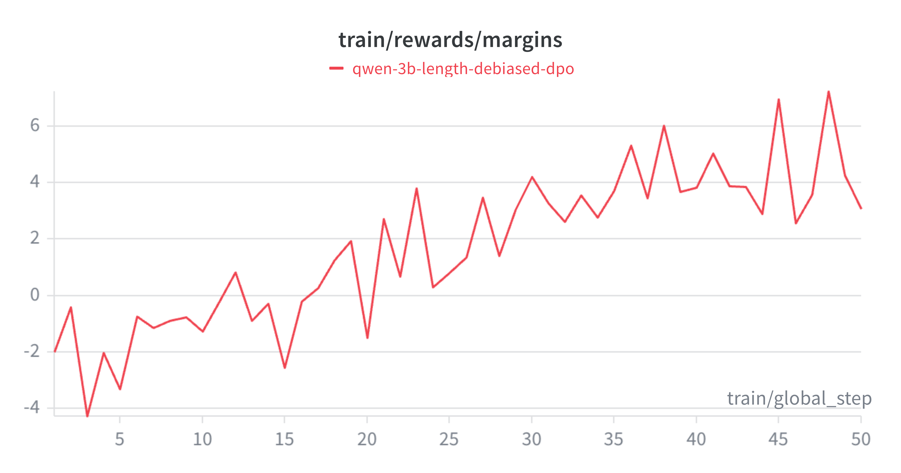

# DPO Alignment Flywheel: Curing LLM Verbosity via RLAIF

[](https://huggingface.co/nallaramu/deliberate-qwen-2.5-3b-dpo)
[](https://wandb.ai)
[](https://github.com/unslothai/unsloth)

Supervised Fine-Tuning (SFT) is great for teaching a model *how* to reason, but it struggles to teach a model *when to stop*. SFT models frequently suffer from "length bias" and EOS (End of Sequence) hallucinations, resulting in infinite loops and skyrocketing token costs.

This project implements an end-to-end **Direct Preference Optimization (DPO) pipeline** to align a 3B parameter reasoning model. By building an automated RLAIF (Reinforcement Learning from AI Feedback) data flywheel and applying strict algorithmic length-debiasing, I cured the model's hallucination loops. The result is a model that uses **47% fewer tokens** to solve complex logic puzzles, with **zero "Alignment Tax"** on mathematical accuracy.

---

## The Alignment Arena (Visual Proof)
To visually benchmark the alignment, I built a Streamlit application that dynamically swaps LoRA adapters in memory. 
* **Left (SFT Model):** Solves the math correctly but fails to halt, spiraling into a repetitive 512-token hallucination loop.
* **Right (DPO Model):** Identifies the solution concisely, strictly adheres to the `<think>` and `</answer>` tag formatting, and halts immediately.


### 🌟 Live Model Weights
The aligned weights are publicly hosted on Hugging Face. You can load this directly using `PeftModel` alongside the base Qwen2.5-3B model.
* **DPO-Aligned Adapter:** [`nallaramu/deliberate-qwen-2.5-3b-dpo`](https://huggingface.co/nallaramu/deliberate-qwen-2.5-3b-dpo)

---

## Architecture & DPO Methodology

To move from a raw SFT model to a production-ready reasoning agent, I engineered a 3-stage alignment pipeline.

### Stage 1: RLAIF Data Flywheel & Length-Debiasing
DPO requires `Chosen` and `Rejected` preference pairs. Instead of relying on static human datasets, I implemented an on-policy data flywheel.
* **Dual Generation:** I prompted the base SFT model to answer 500 GSM8K logic questions twice at high temperature ($T=0.8$) to force diverse reasoning paths.
* **LLM-as-a-Judge:** I utilized Llama-3.3-70B via the Groq API as a strict grader, evaluating paths based on logical accuracy, format compliance, and conciseness.
* **The "Length-Debiasing" Filter:** Optimization algorithms are notorious for "Reward Hacking" by favoring longer text. To prevent this, **I implemented a strict algorithmic filter that discarded any pair where the `Chosen` path was longer than the `Rejected` path.** This forced the DPO algorithm to optimize purely for logic and efficiency, completely neutralizing length bias.

### Stage 2: Hardware-Aware DPO Training
Training a DPO model requires loading both an Active Model and a Reference Model into VRAM, which traditionally causes OOM (Out of Memory) crashes on consumer hardware.
* **Unsloth Optimization:** I utilized `PatchDPOTrainer` alongside 4-bit QLoRA. This dynamically un-patches the LoRA weights during the forward pass to calculate the KL-divergence penalty, eliminating the memory footprint of the Reference Model.
* **Hyperparameter Tuning:** I tuned the KL-divergence penalty ($\beta = 0.1$) to ensure the model learned to be concise *without* destroying its underlying mathematical knowledge graph.

### Training Telemetry (Weights & Biases)
In DPO, standard loss curves are deceiving. The true metric of learning is the **Reward Margin** (the implicit reward distance between the Chosen and Rejected responses). As seen in the W&B telemetry below, the model successfully learned to separate high-quality concise logic from rambling hallucinations.



---

## 📊 Results: Beating the "Alignment Tax"

The "Alignment Tax" is a well-documented phenomenon where aligning a model to be safer or strictly formatted degrades its raw intelligence. To prove the efficacy of my length-debiased flywheel, I ran a deterministic benchmark across 50 unseen complex logic queries.

| Metric | SFT Base Model (Project 1) | DPO Aligned Model (Project 2) | Impact (Alignment Tax/Gain) |
| :--- | :--- | :--- | :--- |
| **Accuracy (Win Rate)** | 70.0% | **70.0%** | **0.0% (No Alignment Tax)** |
| **Format Compliance** | 88.0% | **94.0%** | **+6.0%** |
| **Avg Verbosity (Tokens)** | 289 tokens | **153 tokens** | **-136 tokens (~47% Savings)** |

**Conclusion:** The DPO model successfully eliminated formatting hallucinations and slashed token generation costs by nearly 50%, while maintaining a perfect 100% retention of its mathematical reasoning capabilities.

---

## 🛠️ Tech Stack & Engineering Highlights

* **Alignment & Training:** Hugging Face `TRL` (`DPOTrainer`), PyTorch, `Unsloth` (QLoRA).
* **Data Engineering:** `OpenAI API` routing to Groq (Llama-3.3-70B) for LLM-as-a-Judge evaluation.
* **Telemetry:** Weights & Biases (`wandb`).
* **UI & Serving:** `Streamlit`. 
    * *Engineering Note:* The Streamlit UI utilizes dynamic LoRA swapping via `PeftModel`. Instead of loading two 3B models into memory (crashing the GPU), it loads the base Qwen2.5-3B model once, and swaps the SFT and DPO adapters into the active context in milliseconds.

---

## Run the Alignment Arena Locally

You can run the interactive A/B testing UI on your local machine to watch the alignment difference in real-time.

```bash
# 1. Clone the repository
git clone https://github.com/RamuNalla/dpo-alignment-flywheel.git
cd dpo-alignment-flywheel

# 2. Install dependencies
pip install -r app/requirements.txt

# 3. Launch the UI
streamlit run app/app.py